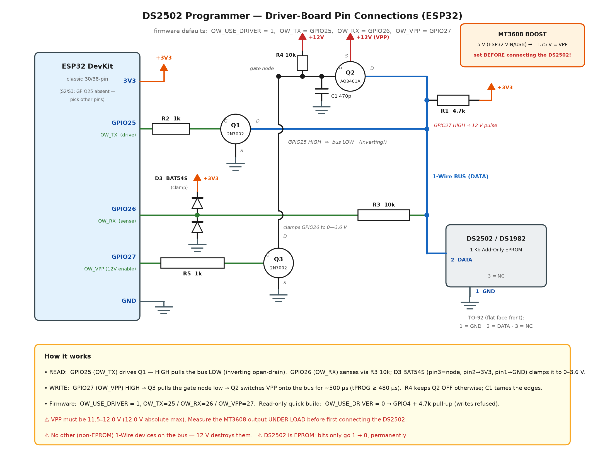

# DS2502_Tool

Read **and write** tool for the **DS2502 1Kb Add-Only Memory** (1-Wire EPROM,
family code `09h`), e.g. as used in Apple MagSafe / Dell / HP power-adapter
identification.

| Component | File | Role |
|---|---|---|
| Bridge firmware | [`ds2502_bridge/ds2502_bridge.ino`](ds2502_bridge/ds2502_bridge.ino) | ESP32 + driver board: split-pin 1-Wire (TX/RX) + 12V VPP switch |
| Desktop GUI | [`ds2502_gui.py`](ds2502_gui.py) | Python/Tkinter app talking to the bridge over USB serial |

## Features

* Read 64-bit ROM ID (Read ROM `33h`, CRC verified)
* Read full 128-byte data memory (Read Memory `F0h`, CRCs verified)
* **Write data memory** (Write Memory `0Fh`) — full datasheet flow:
  per-byte CRC8 check → 12V/480µs program pulse → read-back verification →
  auto-increment CRC rule for subsequent bytes
* Read status register (Read Status `AAh`) with full decoding
* **Write status register** (Write Status `55h`):
  * raw byte writes
  * one-click **write-protect page 0–3** (status byte `00h`, bits WP0–WP3)
  * **page redirection** helper (bytes `01h`–`04h`, one's complement of the
    new page number, `FFh` = no redirection)
* Save memory dump to `.bin`, program a `.bin` file into the chip

> ⚠️ **The DS2502 is EPROM — bits can only be programmed 1 → 0 and can never
> be erased.** All writes are permanent. The GUI asks for confirmation before
> every write.

## Cloning a chip 1:1

Everything lives in the **Cloning** tab:

* **Clone chip (guided)** — reads the ORIGINAL completely (ROM + 128 B data +
  8 B status), prompts you to swap chips, then writes and verifies.
* **Read chip → Save clone dump …** — archives the chip into a single
  `.ds2502` file (JSON: ROM + data + status). Keep it as a backup.
* **Load clone dump → Write to chip …** — clones from the file, no original
  needed. Plain 128-byte `.bin` files are accepted too (data only).

Every clone/dump action also refreshes the *Data memory* hex table and the
decoded *Status register* view, so you always see exactly what was read or
burned.

Safety built in:

1. Refuses if the source chip is still connected (same ROM ID)
2. Refuses if the target already has 0-bits where the source has 1-bits
3. Data is written first and verified byte-for-byte (128/128)
4. Status is written **after** the data — redirection bytes first, the
   write-protect byte `00h` **last** (locking pages first would make the
   data unwritable!) — then verified

> The 64-bit **ROM ID cannot be cloned** — it is factory-lasered and unique
> per chip. Data + status are copied bit-perfect; if the host system
> cross-checks the ROM ID itself, no EPROM clone can pass that check.

## Host rejects the clone? ("cartridge not compatible")

If the original chip works but the verified clone is rejected, the host
(printer etc.) is validating the **ROM ID** — either directly, or through a
signature inside the 128-byte data that is derived from the ROM ID. No real
DS2502 can ever pass that, because the ROM ID is factory-lasered.

The solution is an **emulator**: a microcontroller that behaves like a
DS2502 on the 1-Wire bus and presents the ORIGINAL ROM ID + data + status.

* GUI: *Cloning* tab → **Dump → Emulator sketch …**
* CLI: `python3 make_emulator.py mydump.ds2502 [output_dir]`

This generates an Arduino sketch (based on the
[OneWireHub](https://github.com/orgua/OneWireHub) library, install it via
the Arduino IDE Library Manager) that runs on an **ESP32** (data pin GPIO4)
or an **ATtiny85** (data pin PB2, physical pin 7, clock ≥ 8 MHz). Wiring:
host DATA contact → emulator pin, host GND → MCU GND (common ground is
essential). The emulator needs its own power supply — it cannot run from
1-Wire parasite power like the real chip — and should run at the same logic
voltage as the host bus.

## Status register map (DS2502 datasheet)

| Addr | Meaning |
|---|---|
| `00h` | Write-protect bits: bit0–bit3 = WP for data pages 0–3 (0 = protected) |
| `01h`–`04h` | Page redirection bytes for pages 0–3 (one's complement of new page, `FFh` = none) |
| `05h`–`06h` | Reserved (`FFh`) |
| `07h` | Factory programmed `00h` |

## Pin connections (driver board, png2 schematic)



*(regenerate the PNG with `python3 docs/make_diagram.py`)*

| ESP32 pin | Firmware name | Connects to | Function |
|---|---|---|---|
| **GPIO25** | `OW_TX_PIN` | R2 1 kΩ → Q1 (2N7002) gate; Q1 drain → bus, source → GND | Bus **drive** — **inverting**: GPIO HIGH = bus LOW |
| **GPIO26** | `OW_RX_PIN` | bus → R3 10 kΩ → GPIO26, D3 BAT54S clamp on the GPIO-side node (pin 3 = node, pin 2 → 3V3, pin 1 → GND) | Bus **sense** — clamped to 0–3.6 V, survives the 12 V pulse |
| **GPIO27** | `OW_VPP_PIN` | R5 1 kΩ → Q3 (2N7002) gate; Q3 drain pulls Q2 (AO3401A) gate node (R4 gate pull-up to +12 V, C1 470 p) low; Q2: S → +12 V, D → bus | **12 V enable** — active HIGH |
| **3V3** | — | R1 4.7 kΩ → bus | 1-Wire pull-up |
| **VIN 5V / USB** | — | MT3608 boost IN+ | source for the VPP supply |
| **GND** | — | common ground (ESP32, DS2502, MT3608) | |

DS2502 TO-92, flat face toward you, legs down: **1 = GND · 2 = DATA · 3 = NC**.
Other packages — SO-8: DATA = pin 3, GND = pin 4 · TSOC: GND = 1, DATA = 2 ·
SOT-23: DATA = 1, GND = 2 & 3.

Notes:

* The DS2502 is parasite-powered — only **DATA** and **GND** are connected.
* **VPP:** set the MT3608 boost to **11.75 V measured under load** *before*
  connecting the DS2502. Valid programming window 11.5–12.0 V;
  **12.0 V is the absolute maximum**.
* The firmware drives `OW_VPP_PIN` LOW in `setup()` before anything else, so
  12 V is never applied accidentally.
* **Never** put other (non-EPROM) 1-Wire devices on the bus while
  programming — 12 V will damage them.
* **Read-only quick build** (no 12 V, no driver parts): set
  `OW_USE_DRIVER 0` in the sketch → single pin **GPIO4** open-drain to the
  bus + 4.7 kΩ pull-up to 3V3, GND common. Reads work, writes are refused.
* ESP32-S2/S3 don't have GPIO25 — pick different pins and change the
  `#define`s.

## Bridge — build & flash

1. Arduino IDE (or `arduino-cli`) with the **ESP32** core installed —
   no external libraries needed (the 1-Wire layer is bit-banged in the sketch)
2. Open `ds2502_bridge/ds2502_bridge.ino`, check `OW_USE_DRIVER`,
   `OW_TX_PIN` (25), `OW_RX_PIN` (26), `OW_VPP_PIN` (27), then flash.
   Serial monitor: **115200 baud**.

### Serial protocol (usable manually from any terminal)

```
PING                     -> OK PONG DS2502-BRIDGE v2.0 driver(TX25/RX26/VPP27)
DIAG                     -> bus health report, then OK DIAG IDLE=1 DRIVELOW=1 RELEASE=1 PRESENCE=3
SEARCH                   -> DEV <rom> lines, then OK SEARCH <count>
ROM                      -> OK ROM 09A1B2C3D4E5F607
RDATA <addr> <len>       -> OK DATA 55AA...        (hex, addr/len in hex)
RSTAT                    -> OK STAT FFFFFFFFFFFFFF00
WDATA <addr> <hexbytes>  -> BYTE 0000 W=55 R=55 OK ... OK WDATA <n>
WSTAT <addr> <hexbytes>  -> BYTE 0000 W=FE R=FE OK ... OK WSTAT <n>
```

Errors answer `ERR <reason>` (`NO_DEVICE`, `CMD_CRC`, `WRITE_CRC at ...`,
`VERIFY at ...`, `RANGE`, ...). A write aborts on the first failed byte.

## Troubleshooting: `NO_DEVICE (no presence pulse)`

The serial link is fine (`PING` works) but nothing answered the 1-Wire reset.
Use the **Diagnose bus** button in the GUI (or send `DIAG` / `SEARCH` from a
serial terminal) and check, in order of likelihood:

1. **Wrong pins / wrong build.** Driver board: `OW_TX` = **GPIO25**,
   `OW_RX` = **GPIO26**, `OW_VPP` = **GPIO27** and `OW_USE_DRIVER 1` in the
   sketch. Simple single-pin build: `OW_USE_DRIVER 0` and the bus on
   **GPIO4**. Flashing the wrong build for your hardware = guaranteed
   `NO_DEVICE`.
2. **Missing pull-up.** Without R1 4.7 kΩ from the bus to **3V3** the line
   can't idle high and no presence pulse is possible. A multimeter on the bus
   should read ≈ 3.3 V when idle (`DIAG` reports this as *DQ idle level*).
3. **DS2502 pinout / orientation.** TO-92 with the **flat face toward you,
   legs down: 1 = GND (left), 2 = DATA (middle), 3 = NC (right)**. GND and
   DATA swapped = permanent "no presence".
4. **Driver path broken.** `DIAG`'s *Drive test* exercises
   GPIO25 → R2 → Q1 → bus → R3 → GPIO26. If the bus won't go LOW, check Q1's
   pinout (2N7002 SOT-23: 1 = G, 2 = S, 3 = D), R2, and that Q1's source is
   grounded. If it won't come back HIGH, Q1 is stuck on or the bus is shorted.
5. **12 V switch leaking.** The bus must sit at ~3.3 V idle — if you measure
   ~11.75 V, Q2 is on: check R4 (Q2 gate pull-up to +12 V) is fitted and Q3
   isn't shorted. A DS2502 held at 12 V continuously may be damaged.
6. **Isolate.** Disconnect the MT3608/12 V section — reads need no 12 V. If
   presence appears, the fault is in the VPP switch.

## GUI — run

```bash
pip install -r requirements.txt
python ds2502_gui.py
```

Select the bridge's COM port → **Connect** → use the *Data memory* and
*Status register* tabs.
